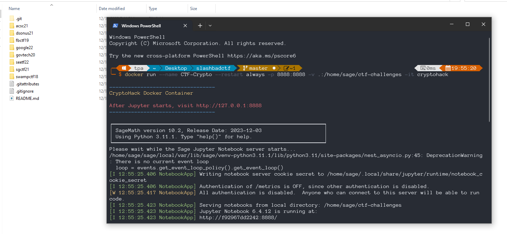
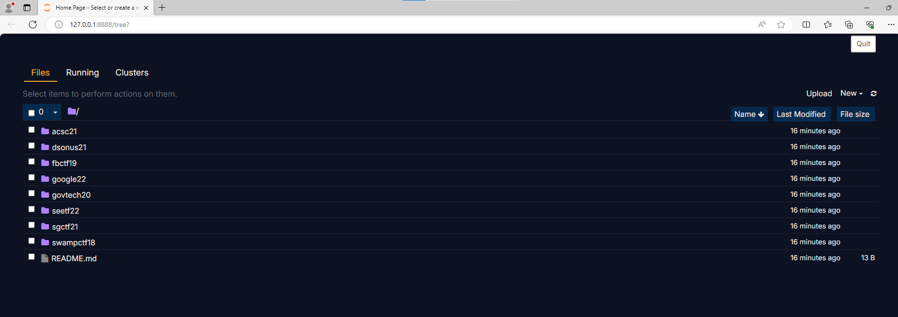
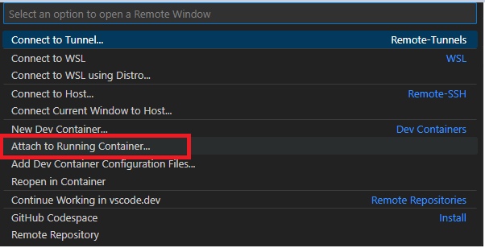
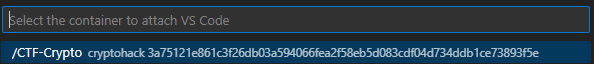
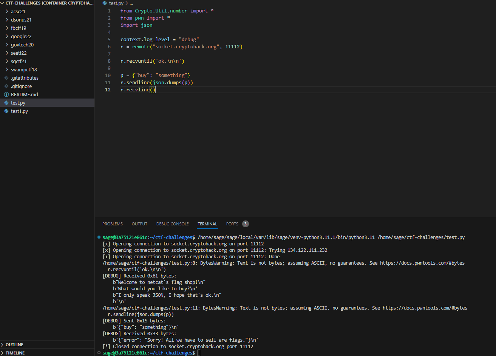
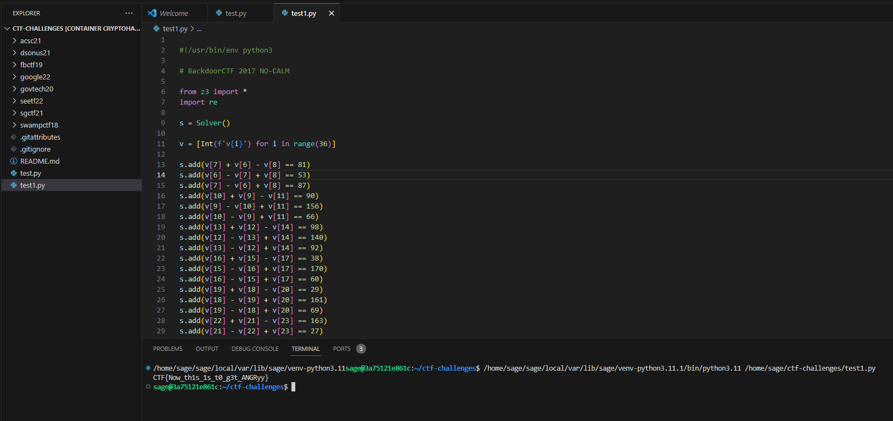
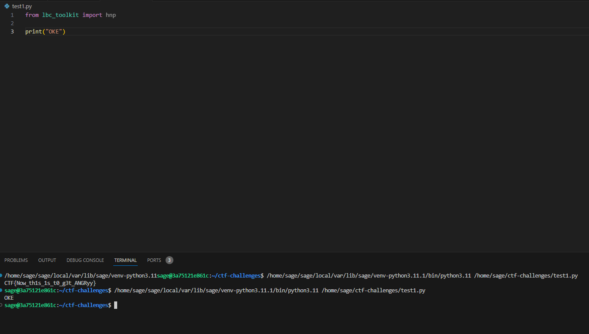
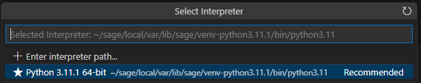

# CryptoHack Docker Container

A Jupyter notebook environment built for attacking crypto CTF challenges, with custom theming matching [CryptoHack](https://cryptohack.org).

It comes with the following installed and integrated:
 - Sage 9 (based on Python3)
 - Pwntools
 - PyCryptodome
 - z3 Prover

## Installation

### Build

```bash
cd cryptohack-docker
docker build . -t cryptohack
```

### Run

Open terminal in root folder CTF

```bash
docker run --name CTF-Crypto --restart always -p 8888:8888 -v .:/home/sage/ctf-challenges -it cryptohack
```





## VS Code













Refer:
- https://github.com/cryptohack/cryptohack-docker
- https://github.com/vishiswoz/cryptohack-docker